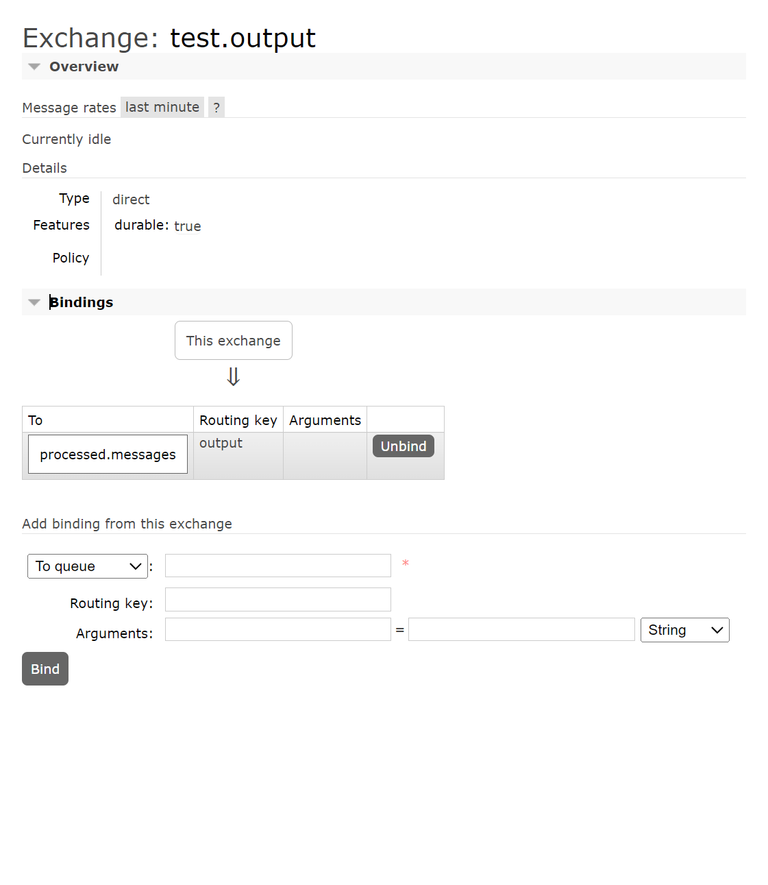
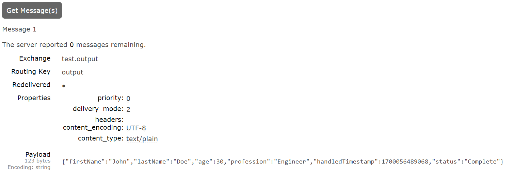
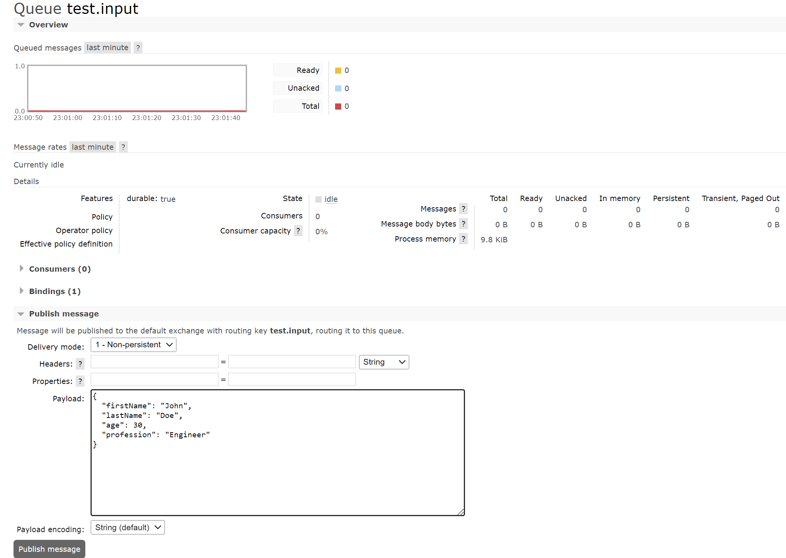

# Queue Processor App

## Описание
Это приложение - пример обработчика очередей, использующего Spring Framework и RabbitMQ.

## Скриншоты

### Обмен данными через Exchange

### Обработанные сообщения в очереди

### Сообщения в очереди test.input

